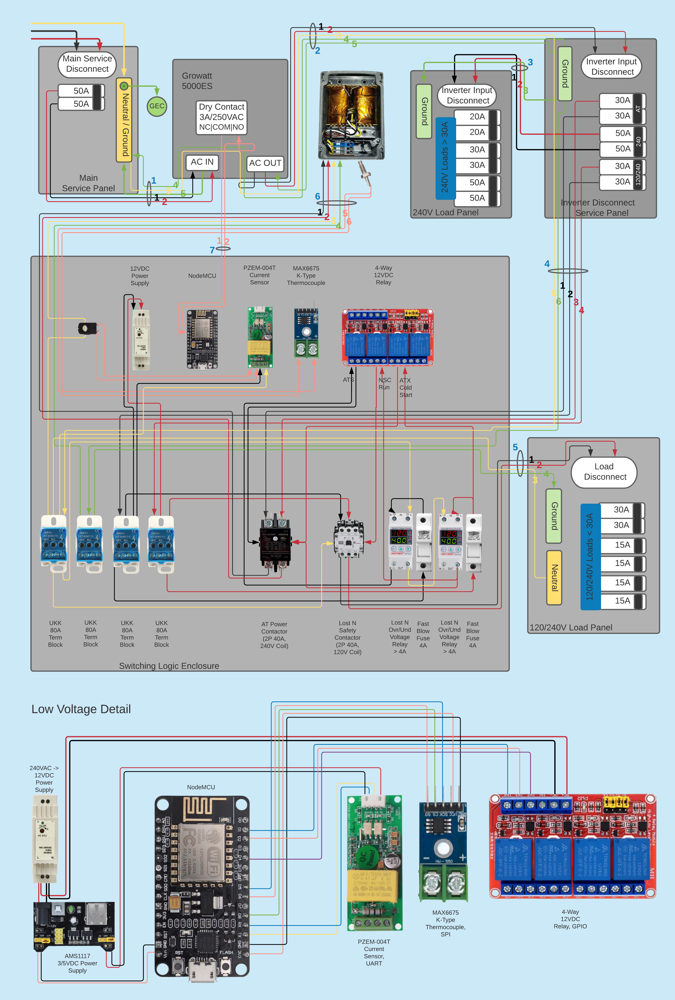

Continuation of the [5KES megadthread at
DIYSolarForum](https://diysolarforum.com/threads/design-review-growatt-spf-5000-es-grid-backup-neutral-bonding.29717/)

Specifically, the code implementation of [design
#216](https://diysolarforum.com/threads/design-review-growatt-spf-5000-es-grid-backup-neutral-bonding.29717/post-402492)

### Latest schematic:

